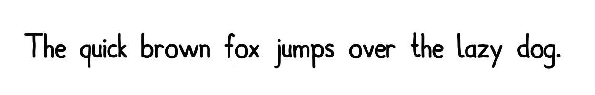
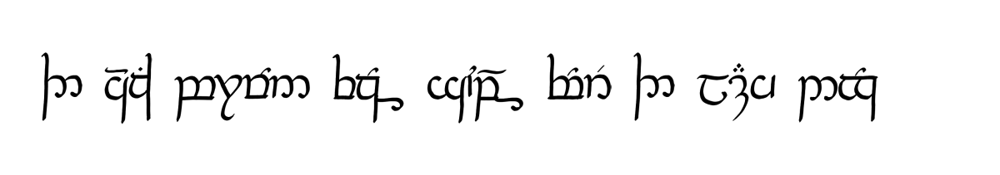

# Fonter

Make and render texture-based fonts. Can be used for Tengwar-like writing systems, although it can theoretically get arbitrarily complex. Supports find-and-replace (to parse the text to be rendered, e.g. to apply orthographic rules or form ligatures) and diacritics. One big downside is that vector-based fonts are not supported, as it is, unlike Graphite, not meant to be an actual font system to be used universally. Really, it's just for fun. Enjoy!




## Building

*Tested on Linux*  
Build using Cmake (uses C++17):
```
cmake -S path/to/fonter -B path/to/build/dir
cd path/to/build/dir
make
```

## Usage
Run like this:
```
fonter -f path/to/font -t "input text to render"
```
It will generate an image of the text rendered in the selected font.  
All other options can be viewed by running:
```
fonter help
```

## Fonts

Fonts are defined in `.fonter` files. There are two sample fonts (comic, Tengwar) in [`fonts`](fonts) and [`font_syntax.md`](font_syntax.md) describes how to write your own font.
